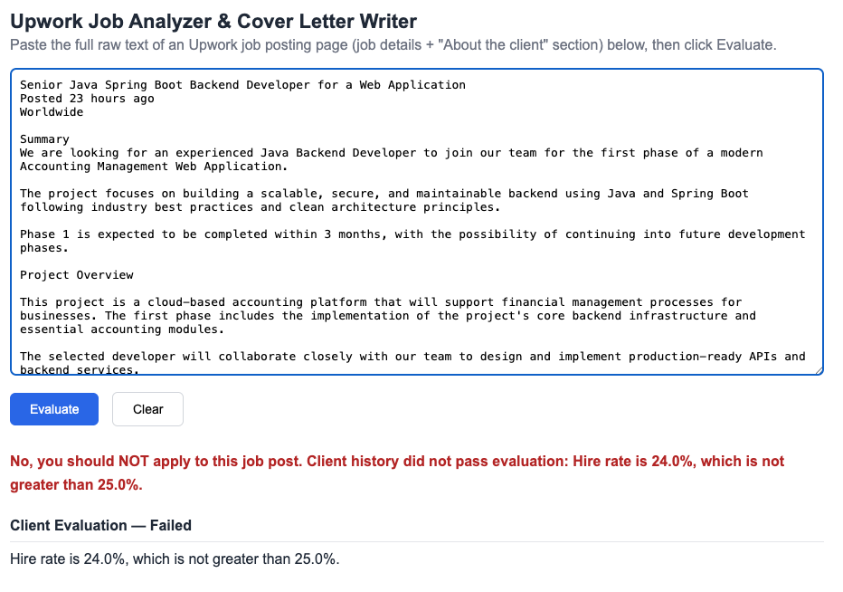
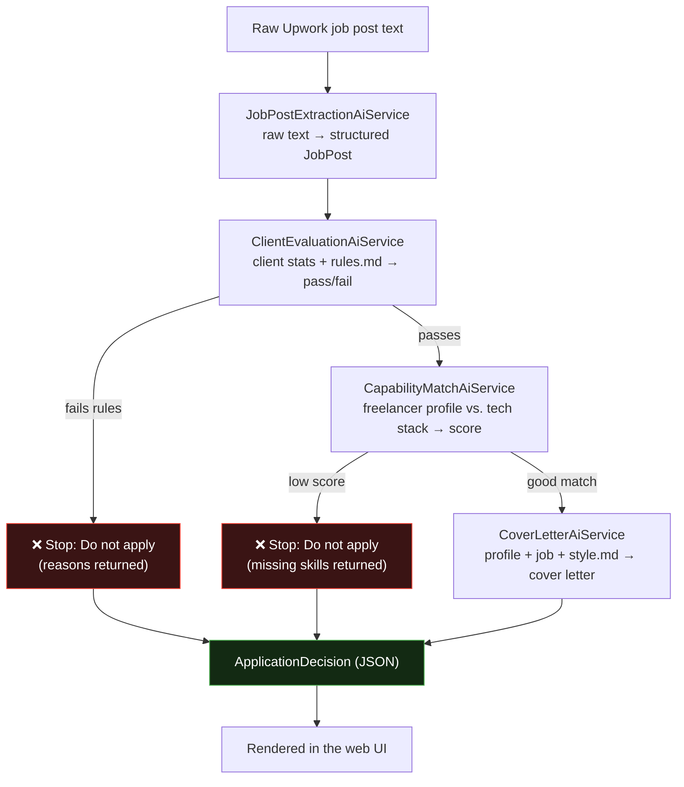
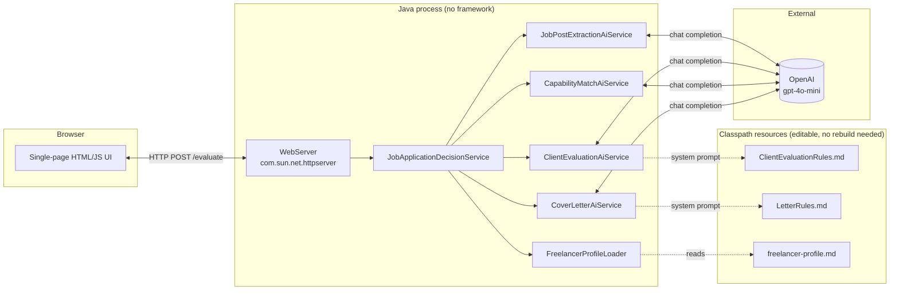

# 🎯 Upwork Job Analyzer

**A production-style, multi-step AI decision pipeline built in Java — not a prompt-in-a-chatbox toy.**

Given the raw text of an Upwork job post, this system autonomously decides *whether you should even apply* — and if it's a good fit, writes the cover letter for you. Every step is a typed, testable, independently swappable Java component powered by [LangChain4j](https://github.com/langchain4j/langchain4j) and OpenAI.

[](https://openjdk.org/projects/jdk/21/)
[](https://github.com/langchain4j/langchain4j)
[](https://platform.openai.com/)
[](https://maven.apache.org/)
[](#architecture)
[](#license)

<p align="center">
  <em>⭐ If this project shows you something useful about building real AI systems in Java, consider starring it.</em>
</p>

---

## 📸 Demo

<p align="center">
  
</p>

<p align="center"><sub>The client-evaluation stage rejecting a job post because the client's hire rate (24%) falls below the configured 25% threshold — before a single token is spent on capability matching or cover-letter generation.</sub></p>

> Paste a job post → get a structured, explainable go/no-go decision → get a tailored cover letter, all in one shot.


---

## 🧩 The Problem

Freelancers on Upwork burn hours every day on the *same* repetitive triage:

1. Read a wall of job-post text.
2. Manually check the client's hire rate, verified payment, total spend, and hidden red flags.
3. Judge — subjectively — whether their own skills actually match what's required.
4. Write a cover letter from scratch, hoping it sounds tailored rather than templated.

None of this is hard. All of it is tedious, inconsistent, and easy to get wrong when you're tired or in a hurry to submit before the proposal slots fill up.

## 💡 Why I Built This

I wanted to build something that goes beyond "call an LLM and print the response." This project is my answer to a real question:

> **How do you design a multi-step, business-rule-driven AI workflow in Java the way you'd design any other production system — with typed contracts, separation of concerns, and configuration that doesn't require touching code?**

So instead of one giant prompt trying to do everything, the problem is decomposed into a **pipeline of independent, single-responsibility AI services** — the same way you'd decompose a non-AI backend into services and stages. Business rules live in editable Markdown files, not buried in Java strings. Every intermediate result is a typed Java `record`, inspectable and testable on its own.

This repo is a demonstration of applying **real software engineering discipline** to an LLM-powered application.

---

## ✨ Features

| | |
|---|---|
| 🧱 **Multi-step pipeline, not a black box** | Four independently testable stages orchestrated in plain Java — no hidden agent loop, no magic. |
| 🧾 **Structured outputs everywhere** | LangChain4j parses every model response directly into typed Java `record`s — zero manual JSON parsing. |
| 📜 **Rules as data, not code** | Client-evaluation rules and cover-letter style guides live in Markdown files loaded as system prompts. Tune AI behavior with zero recompilation. |
| 🖥️ **Zero-dependency web layer** | A full HTTP API + single-page UI using nothing but the JDK's built-in `HttpServer` — no Spring, no npm, no build step for the front end. |
| 🔐 **No hardcoded secrets** | API key resolved exclusively from environment variables / JVM properties at runtime. |
| ⏹️ **Fail-fast short-circuiting** | Bad client? Stops before wasting a token on a cover letter. Skill mismatch? Stops before wasting another. |

---

## 🏗️ Architecture

The whole pipeline is expressed as a chain of small, single-purpose **LangChain4j `AiService` interfaces** — declarative contracts, not imperative prompt-building code.



### Runtime component view



**Design principle:** each `AiService` is a plain Java interface. LangChain4j's `@SystemMessage` / `@UserMessage` / `@V` annotations declare the prompt; `AiServices.create(Interface.class, model)` generates the implementation and the response parser at runtime. The orchestration logic (`JobApplicationDecisionService`) never touches raw JSON or prompt strings — it composes typed method calls, just like any other service layer.

---

## ⚙️ How It Works

| Step | Service | Input → Output | Short-circuits on |
|------|---------|-----------------|--------------------|
| 0 | `JobPostExtractionAiService` | Raw pasted text → `JobPost` (title, description, tech stack, `ClientInfo`) | — |
| 1 | `ClientEvaluationAiService` | Client stats + job text + `ClientEvaluationRules.md` → `ClientEvaluationResult` | Rule failure → stop, return reasons |
| 2 | `CapabilityMatchAiService` | Freelancer profile + job description → `CapabilityMatchResult` (score /10) | Score too low → stop, return missing skills |
| 3 | `CoverLetterAiService` | Freelancer profile + job description + `LetterRules.md` → cover letter `String` | — |

The result of every path — pass or fail — is assembled into a single `ApplicationDecision` record and returned as JSON.

---

## 📁 Project Structure

```
src/main/java/org/example/
├── Main.java                              # Builds the OpenAiChatModel, starts the server
├── web/
│   └── WebServer.java                     # com.sun.net.httpserver-based HTTP layer
├── service/
│   ├── JobApplicationDecisionService.java # Orchestrates the full pipeline
│   └── FreelancerProfileLoader.java       # Loads freelancer-profile.md from the classpath
├── aiservices/services/
│   ├── JobPostExtractionAiService.java    # Raw text → structured JobPost
│   ├── ClientEvaluationAiService.java     # Client/job rules check
│   ├── CapabilityMatchAiService.java      # Tech-stack match scoring
│   ├── CoverLetterAiService.java          # Cover letter generation
│   ├── AssistantAiService.java            # Generic chat example
│   └── ChefAiService.java                 # Minimal system-message example
└── model/
    ├── JobPost.java                       # title, description, requiredTechStack, client
    ├── ClientInfo.java                    # hireRate, paymentVerified, totalSpent, avgHourlyRate
    ├── ClientEvaluationResult.java        # passed, failedReasons
    ├── CapabilityMatchResult.java         # score, matchedTechnologies, missingTechnologies, reasoning
    └── ApplicationDecision.java           # shouldApply, summary, results, coverLetter

src/main/resources/
├── ClientEvaluationRules.md   # Editable business rules — no rebuild required
├── LetterRules.md             # Editable cover-letter style guide
├── freelancer-profile.md      # Your resume/CV — plug in your own skills
└── static/index.html          # Zero-build single-page front end
```

---

## 🛠️ Tech Stack

| Component | Choice | Why |
|---|---|---|
| Language | **Java 21** | Records, pattern-friendly, modern text blocks for prompts |
| AI orchestration | **[LangChain4j](https://github.com/langchain4j/langchain4j) 1.17.0** | Declarative AI services, automatic structured output parsing |
| LLM provider | **OpenAI `gpt-4o-mini`** via `langchain4j-open-ai` | Fast, cheap, strong at structured extraction |
| Web layer | **JDK `com.sun.net.httpserver.HttpServer`** | Proves the pipeline stands on its own — no framework required to demonstrate the architecture |
| Build tool | **Maven** | Standard, zero surprises |
| Front end | **Plain HTML/CSS/JS** | No npm, no build step, no framework lock-in |

---

## 🚀 Getting Started

### Prerequisites

- **JDK 21+**
- **Maven 3.8+**
- An **OpenAI API key** with access to `gpt-4o-mini`

### 1. Clone

```bash
git clone https://github.com/<your-username>/UpworkJobAnalyzer.git
cd UpworkJobAnalyzer
```

### 2. Set your API key

```bash
export OPENAI_API_KEY="sk-..."
```

or pass it as a JVM property:

```bash
-Dopenai.api.key=sk-...
```

The key is **never** read from source code or committed anywhere.

### 3. Personalize your profile (optional but recommended)

Replace `src/main/resources/freelancer-profile.md` with your own resume/CV summary so the capability match and cover letter reflect **your** skills.

### 4. Build & run

```bash
mvn clean package
mvn exec:java -Dexec.mainClass="org.example.Main"
```

or just run `Main.java` from your IDE. You should see:

```
Upwork Job Analyzer is running: http://localhost:8090
```

### 5. Use it

Open [http://localhost:8090](http://localhost:8090), paste the raw text of an Upwork job posting (job details + "About the client" section), and click **Evaluate**.

---

## ⚙️ Configuration

Everything below is tunable **without touching a single line of Java**:

| File | Controls |
|---|---|
| `ClientEvaluationRules.md` | Minimum hire rate, spend threshold, English level, proposal count, job age, etc. |
| `LetterRules.md` | Tone, length, structure, do's and don'ts for the generated cover letter |
| `freelancer-profile.md` | Your skills used in capability matching + cover letter generation |
| `Main.java` | Swap the model (`OpenAiChatModelName`) or the server port |

---

## 🔌 API

| Method | Path | Description |
|--------|------|-------------|
| `GET` | `/` | Serves the single-page UI |
| `POST` | `/evaluate` | Body = raw pasted job post text → JSON `ApplicationDecision` |

### Example Workflow

**Request** (`POST /evaluate`, plain text body):

```
Senior Java Backend Developer
Posted 3 hours ago

Summary: We need an experienced Java engineer to build a REST API...

Skills and Expertise
Mandatory skills: Java, Spring Boot, PostgreSQL, AWS

About the client
Payment method verified
$45K total spent
92% hire rate, 2 open jobs
$38.50 /hr avg hourly rate paid
```

**Response:**

```json
{
  "shouldApply": true,
  "summary": "Yes, you should apply to this job post. It is a good opportunity for you and fits with your expertise.",
  "clientEvaluation": { "passed": true, "failedReasons": [] },
  "capabilityMatch": {
    "score": 8.5,
    "matchedTechnologies": ["Java", "Spring Boot", "PostgreSQL"],
    "missingTechnologies": ["AWS"],
    "reasoning": "Strong backend alignment; cloud experience is the only gap."
  },
  "coverLetter": "Hi, I read through your job post and..."
}
```

If the client fails the rules, the pipeline stops early:

```json
{
  "shouldApply": false,
  "summary": "No, you should NOT apply to this job post. Client history did not pass evaluation: Hire rate below 50%; Total spent below $500 threshold",
  "clientEvaluation": { "passed": false, "failedReasons": ["Hire rate below 50%", "Total spent below $500 threshold"] },
  "capabilityMatch": null,
  "coverLetter": null
}
```

---

## 🌟 Technical Highlights

- **Typed AI contracts.** Every `AiService` is a plain Java interface — no string concatenation, no manual JSON parsing, no runtime type surprises.
- **Configuration as data.** Business rules and writing style are Markdown files on the classpath, not string literals buried in Java. Non-developers could edit them.
- **Explicit short-circuiting.** The pipeline is a deterministic Java `if`-chain, not an autonomous agent loop — completely predictable, debuggable, and cheap (never wastes a call on a doomed cover letter).
- **Framework-free by design.** The HTTP layer intentionally uses only the JDK, proving the AI architecture doesn't depend on Spring/Micronaut/etc. to be production-grade.
- **Secrets hygiene.** API key resolution is centralized and fails fast with a clear error if missing — never silently falls back to a hardcoded value.
- **Separation of concerns.** Extraction, evaluation, matching, and generation are four separate services — each swappable, mockable, and unit-testable in isolation.

---

## ❓ FAQ

**Why a custom HTTP server instead of Spring Boot?**
To prove the AI orchestration layer is the interesting part — it works the same with any web framework, or none at all.

**Can I use a different LLM provider?**
Yes. LangChain4j supports many providers (Anthropic, Gemini, local models via Ollama, etc.). Swap the `ChatModel` implementation in `Main.java`; the `AiService` interfaces don't change.

**Is my freelancer profile sent to OpenAI?**
Yes — it's included in every capability-match and cover-letter prompt. Don't put sensitive data in `freelancer-profile.md` that you don't want sent to the API.

**Why records instead of a JSON library like Jackson?**
LangChain4j handles structured-output parsing natively based on the return type of the `AiService` method — no extra dependency needed.

---

## 🗺️ Roadmap

- [ ] Persist evaluated jobs (SQLite/Postgres) to avoid re-evaluating duplicates
- [ ] Batch-mode: paste multiple job posts at once
- [ ] Pluggable LLM provider selection via config, not code
- [ ] Unit tests around each `AiService` using LangChain4j's testing utilities
- [ ] Dockerfile for one-command startup

---

## 🤝 Contributing

Issues and PRs are welcome — this project is meant to be read, forked, and improved.

1. Fork the repo
2. Create a feature branch (`git checkout -b feature/my-idea`)
3. Commit your changes
4. Open a PR

---

## 📄 License

MIT — see [LICENSE](LICENSE). Free to fork, adapt, and use for your own freelancing workflow.

---

<p align="center">
  Built to show what a well-engineered, multi-step AI workflow in Java actually looks like.<br/>
  <strong>⭐ Star this repo if it helped you think differently about building AI apps.</strong>
</p>
